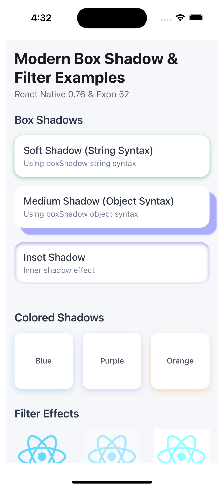
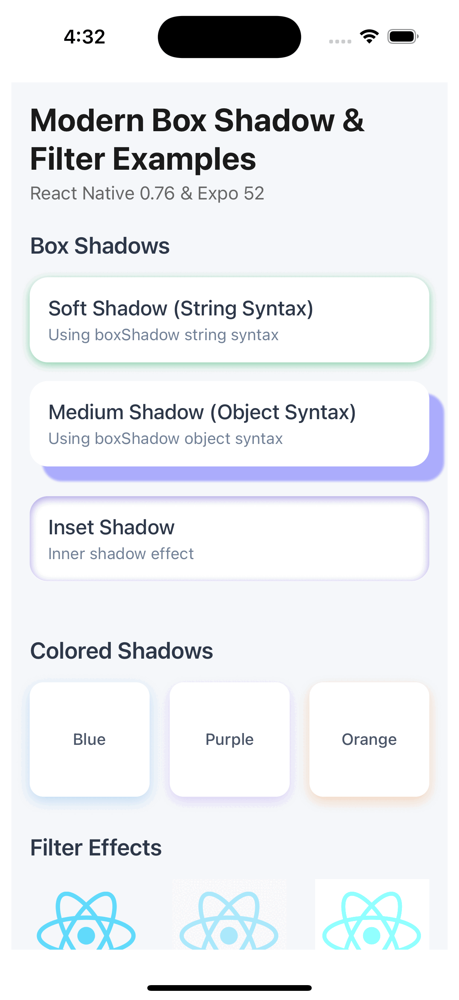

# React Native UI Components

A collection of modern, reusable React Native UI components with detailed documentation and examples.

## Components

### 3. Performant PopUp Toast

**Location**: `components/PopUpToast/index.tsx`

A comprehensive showcase of modern animated toast UI in React Native using `react-native-reanimated`,

demonstrating:

- Animated toast messages
- Toast types (success, error)

**Screenshots:**

## Demo

### 2. Performant non-blockingUI

**Location**: `components/PerformantUI/index.tsx`

A comprehensive showcase of modern non-blocking UI in React Native using `useLayoutEffect`, `useTransition`, `Suspense` and `lazy`, demonstrating:

- Lazy loading of components
- Non-blocking UI with `useTransition` and `Suspense`
- `useLayoutEffect` for synchronizing the UI with data

**Screenshots:**

## Demo

### 1. Box Shadow & Filter Examples

**Location**: `components/BoxShadowFilter/index.tsx`

A comprehensive showcase of modern box shadow and filter effects in React Native, demonstrating:

- String and object syntax box shadows
- Colored shadows with customizable opacity
- Filter effects (opacity, brightness)
- Interactive shadow animations
- Inset shadows

**Key Features:**

- Animated press interactions
- Customizable shadow properties
- Multiple filter effects
- TypeScript support
- Expo compatible

**Screenshots:**

## Demo

**Usage Example:**
